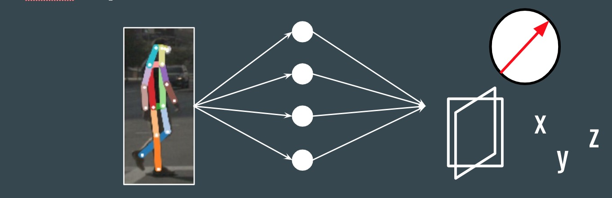
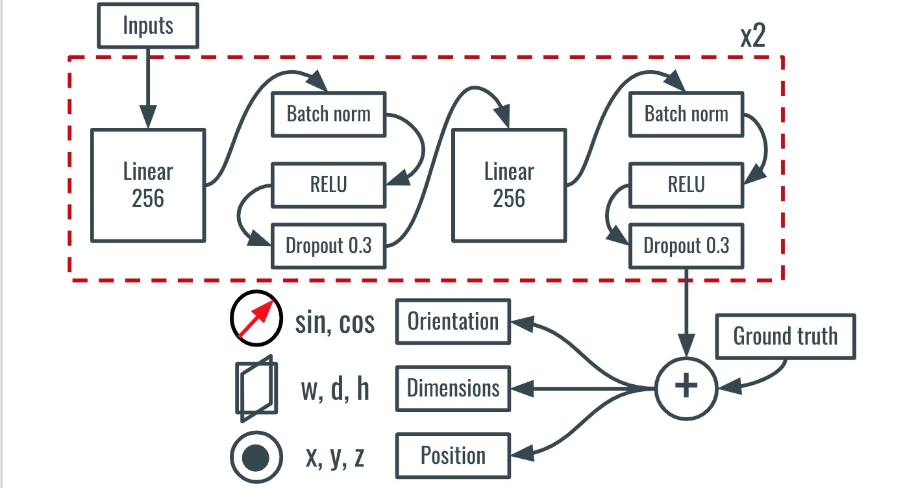
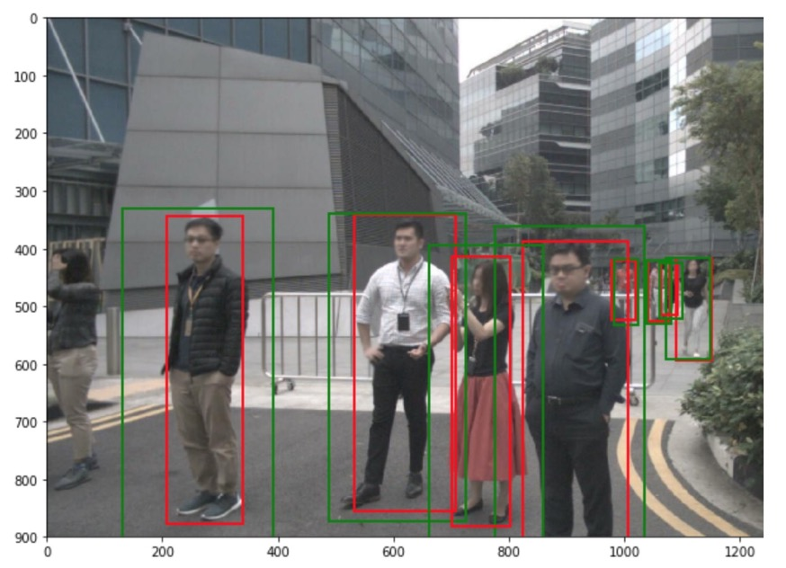
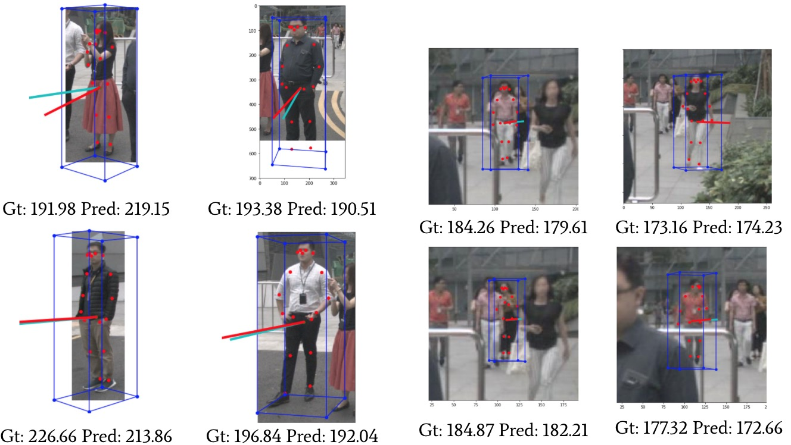
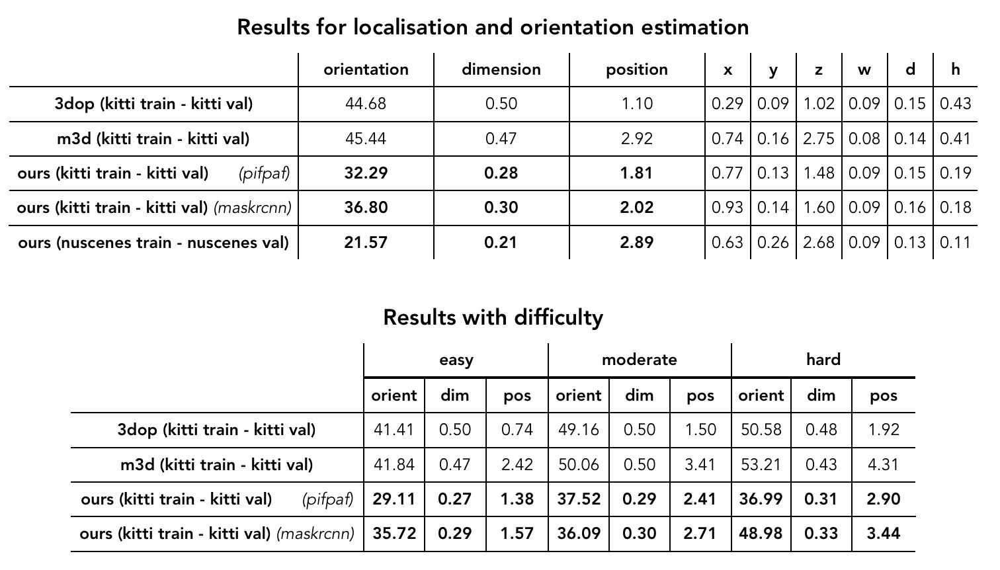

# Pedestrian Orientation, Dimension and Localization estimation
 The goal of this project is to estimate the orientation, localization and dimensions of pedestrians using a multi-task loss neural network taking 2D body joints as inputs. This is a semester project by Jean Marc Bejjani supervised by Lorenzo Bertoni and Prof. Alexandre Alahi at the VITA lab, EPFL.
 


## Overview
- [Code Structure](#Code-Structure)
- [Network Architecture](#Network-Architecture)
- [Datasets download](#dataset-download)
- [Requirements](#Requirements)
- [Tutorial](#tutorial)
- [Results](#Results)

## Code Structure
The code is structured as follow:

```
src/
    kitti-baselines - everything required to get the results for other baseline methods: m3d, 3dop evaluated on KITTI Dataset.
    kitti-maskrcnn - everything required to train and evaluate our method on KITTI Dataset using mask-rcnn joints as inputs.
    kitti-pifpaf - everything required to train and evaluate our method on KITTI Dataset using pifpaf joints as inputs.
    nuscenes-pifpaf - everything required to train and evaluate our method on Nuscenes Dataset using pifpaf joints as inputs.
 
intermediate-data/
    kitti-baselines - all the preprocessed data and checkpoints for running src/kitti-baselines
    kitti-maskrcnn - all the preprocessed data and checkpoints for running src/kitti-maskrcnn
    kitti-pifpaf - all the preprocessed data and checkpoints for running src/kitti-pifpaf
    nuscenes-pifpaf - all the preprocessed data and checkpoints for running src/nuscenes-pifpaf
```
## Network Architecture

Here you can find the neural network architecture used in our model.




## Dataset download

We already provide the KITTI ground truth annotation in this repo. You only need to download the images for visualizing the results and place them in the following path:
```
for testing images:
          kitti-data/test/image_2/image_02/data/

for training images:
          kitti-data/train/image_2/image_02/data/

```
To download nuScenes you need to go to the [Download page](https://www.nuscenes.org/download), 
create an account and agree to the nuScenes [Terms of Use](https://www.nuscenes.org/terms-of-use).
After logging in you will see multiple archives. 
You will need to download *all* archives.
Please unpack the archives to the `/src/nuscenes-pifpaf/data/sets/nuscenes` folder \*without\* overwriting folders that occur in multiple archives.
Eventually you should have the following folder structure:
```
/src/nuscenes-pifpaf/data/sets/nuscenes
    samples	-	Sensor data for keyframes.
    sweeps	-	Sensor data for intermediate frames.
    maps	-	Large image files (~500 Gigapixel) that depict the drivable surface and sidewalks in the scene.
    v1.0-*	-	JSON tables that include all the meta data and annotations. Each split (trainval, test, mini) is provided in a separate folder.
```
Also if you want to use another dataset you should run pifpaf or mask-rcnn on your images and place the results in the corresponding path.

To re-run all the Nuscenes notebooks you should have the pifpaf annotations in the following folder:

```
/intermediate_data/nuscenes-pifpaf/output_pifpaf
```

Similarly to re-run all the kitti notebooks you should have the pifpaf annotations in the following folder:

```
/intermediate_data/kitti-pifpaf/output_pifpaf
```

## Requirements

The code was run on python 3.7.

Nuscenes devkit can be installed via pip:
```
pip install nuscenes-devkit
```
other requirements:
```
pytorch
opencv
numpy
matplotlib
scikit-image
PIL
```

## Tutorial

### Train or test the models

All the data has been preprocessed so in order to train or test the models, there is no need to download the datasets. The Image data sets are only required to visualize the results.
all you need to do is run the following notebooks:

for Nuscenes with pifpaf joints:

    src/nuscenes-pifpaf/multiloss-NeuralNet.ipynb
    
for kitti with pifpaf joints:

    src/kitti-pifpaf/train_ours.ipynb
    
for kitti with maskrcnn joints:

    src/kitti-maskrcnn/train_ours.ipynb
    
for evaluating the baselines with kitti:

    src/kitti-baselines/eval-baselines.ipynb
    
### Run the preprocess

If you download all the datasets as described in [Datasets download](#dataset-download), you can run the pre-processing notebooks in the following order:

for Nuscenes with pifpaf joints:

    1. src/nuscenes-pifpaf/get_orientations.ipynb
    
    2. src/nuscenes-pifpaf/match_data.ipynb
    
    3. src/nuscenes-pifpaf/split_train_val.ipynb
    
    4. src/nuscenes-pifpaf/multiloss-NeuralNet.ipynb
    
    
for kitti with pifpaf joints:

    1. src/kitti-pifpaf/get-data.ipynb
    
    2. src/kitti-pifpaf/train_ours.ipynb
  
for kitti with maskrcnn joints:

    1. src/kitti-maskrcnn/get-data.ipynb
    
    2. src/kitti-maskrcnn/train_ours.ipynb
    
for evaluating the baselines with kitti:

    src/kitti-baselines/eval-baselines.ipynb

## Results

Here are some examples of pedestrians with the correct and predicted orientations.



Here are the results comparing the baselines and using 2 keypoints methods:




